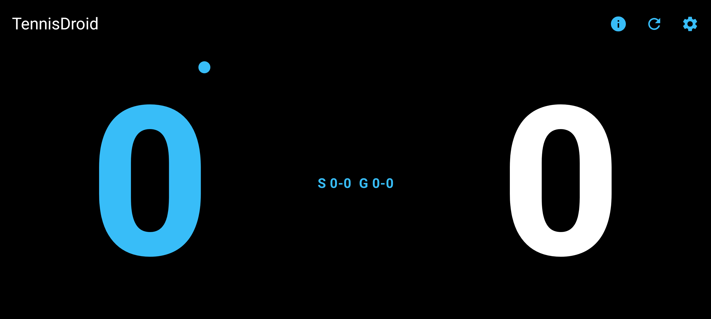

# TennisDroid

A tennis score-tracking app for Android that lets you keep score hands-free using a Bluetooth remote button — perfect for when you're on the court and can't touch your phone.

## What It Does

- **Hands-free scoring** — Use any Bluetooth remote button to track points without touching your phone
  - Single click: add a point for you
  - Double click: add a point for your opponent
  - Long press: undo the last point
- **3 match formats** — Standard (best-of-3 sets), League (3rd set is a 10-point tiebreak), and Fast (single 8-game pro set, no advantage scoring)
- **Voice announcements** — The app calls out the score after each point, just like a real umpire
- **Customizable** — Set player names, adjust button sensitivity, and choose from multiple color themes
- **Tap input** — You can also tap the screen to score if you prefer

## Screenshots

<p align="center">
  
</p>
<p align="center">
  
</p>
<p align="center">
  
</p>

## How to Install

**Requires Android 8.0 or newer.**

### Option A: Download the APK (easiest)

1. Go to the [Releases](https://github.com/tiratatp/tennis_score_tracker/releases) page on GitHub
2. Download the latest `.apk` file to your Android device
3. Open the file on your device and follow the prompts to install
   - You may need to allow "Install from unknown sources" in your device settings

### Option B: Build from source

1. Clone this repository
2. Connect your Android device via USB
3. Enable Developer Options and USB Debugging on your device (Settings > About phone > tap "Build number" 7 times, then Settings > Developer options > USB debugging)
4. Run:
```bash
./gradlew installDebug
```

## Technical Details

<details>
<summary>For developers — architecture, build commands, and project structure</summary>

### Architecture

Single-activity Android app built with Kotlin and Jetpack Compose. Scoring logic operates as a finite state machine with immutable state and a LIFO stack for undo.

### Project Structure

- **Hardware Input**: `KeyEventManager` intercepts raw HID KeyEvent inputs and uses a coroutine-based temporal debouncing algorithm to distinguish single click, double click, and long press from one button
- **Scoring Engine**: `ScoreManager` exposes match state via `StateFlow` — pure state transformations with no side effects
- **Storage**: Jetpack Preferences DataStore for settings (key codes, latency thresholds, player names, theme)
- **TTS**: UK English locale with umpire-style speech rate and pitch
- **CI/CD**: GitHub Actions runs detekt, ktlint, unit tests, and assembleDebug on push/PR. Tagged pushes (`v*`) create GitHub Releases with the APK

### Build Commands

```bash
./gradlew assembleDebug          # Build debug APK
./gradlew testDebugUnitTest      # Run unit tests
./gradlew ktlintCheck detekt     # Run linters (ktlint + detekt)
./gradlew installDebug           # Install on device (also runs tests + linters)
```

</details>

## License

This project is licensed under the MIT License — see the [LICENSE](LICENSE) file for details.
