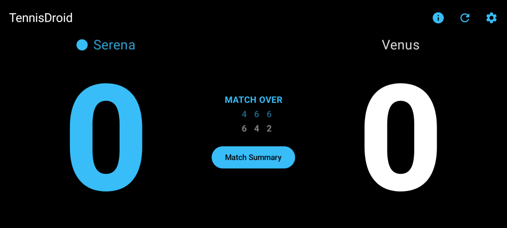
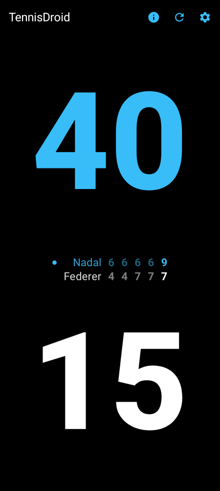
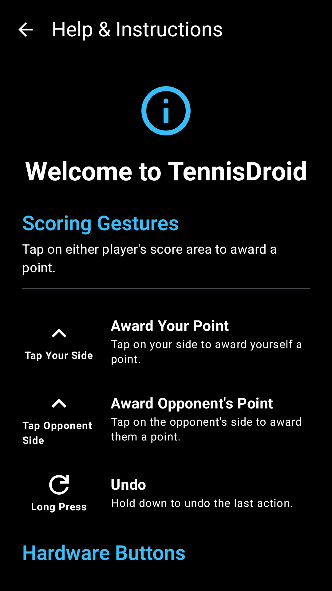
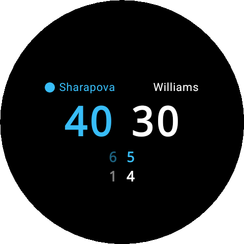

# TennisDroid

A tennis score-tracking app for Android that lets you keep score hands-free using a Bluetooth remote button — perfect for when you're on the court and can't touch your phone.

## What It Does

- **Hands-free scoring** — Use any Bluetooth remote button to track points without touching your phone
  - Single click: add a point for you
  - Double click: add a point for your opponent
  - Long press: undo the last point
- **3 match formats** — Standard (best-of-3 sets), League (3rd set is a 10-point tiebreak), and Fast (single 8-game pro set, no advantage scoring)
- **Voice announcements** — The app calls out the score after each point, just like a real umpire
- **Auto-detect your remote** — Tap "Detect Button" in settings, press any button on your remote, and the app automatically identifies and saves the key code
- **Customizable** — Set player names, adjust button sensitivity, and choose from multiple color themes
- **Tap input** — You can also tap the screen to score if you prefer
- **Wear OS companion** — See the live score on your watch and tap to score directly from your wrist

## Screenshots

### Phone

<p align="center">
  
</p>
<p align="center">
  &nbsp;&nbsp;
  
</p>

### Wear OS

<p align="center">
  
</p>

## How to Install

**Requires Android 8.0 or newer.** Wear OS app requires Android 11+ (API 30) on the watch.

### Option A: Download the APK (easiest)

1. Go to the [Releases](https://github.com/tiratatp/tennis_score_tracker/releases/latest) page on GitHub
2. Download the APK for your device:
   - **`tennisdroid-<version>.apk`** — Phone app. Install on your Android phone or tablet.
   - **`tennisdroid-wear-<version>.apk`** — Wear OS app. Install on your Android watch for live score display and tap-to-score. Requires the phone app to be installed and paired.
3. Open the file on your device and follow the prompts to install
   - You may need to allow "Install from unknown sources" in your device settings

### Option B: Build from source

1. Clone this repository
2. Connect your Android device via USB
3. Enable Developer Options and USB Debugging on your device (Settings > About phone > tap "Build number" 7 times, then Settings > Developer options > USB debugging)
4. Run:
```bash
./gradlew installDebug           # Install phone app
./gradlew :wear:installDebug     # Install wear app on watch
```

## Technical Details

<details>
<summary>For developers — architecture, build commands, and project structure</summary>

### Architecture

Multi-module Android app (app + shared + wear) built with Kotlin and Jetpack Compose. Scoring logic operates as a finite state machine with immutable state and a LIFO stack for undo.

### Project Structure

- **Hardware Input**: `KeyEventManager` intercepts raw HID KeyEvent inputs and uses a coroutine-based temporal debouncing algorithm to distinguish single click, double click, and long press from one button
- **Scoring Engine**: `ScoreModel` exposes match state via `StateFlow` — pure state transformations with no side effects
- **Storage**: Jetpack Preferences DataStore for settings (key codes, latency thresholds, player names, theme)
- **TTS**: UK English locale with umpire-style speech rate and pitch
- **Wear OS Sync**: `WearSyncManager` in the phone app pushes match state to the watch via Wearable Data Layer API; receives scoring commands back via `MessageClient`
- **Shared Module**: `WearConstants` (data paths, command strings) and `WearScoreDisplay` (JSON-serializable score snapshot) shared between phone and watch
- **Wear Module**: Standalone Wear OS app — `WearMainActivity` with ambient mode support, `WearRemoteViewModel` listens for score updates and sends commands, `WearScoreScreen` with tap zones (left=you, right=opponent, long-press=undo)
- **CI/CD**: GitHub Actions runs detekt, ktlint, unit tests, and assembleDebug on push/PR. Tagged pushes (`v*`) create GitHub Releases with the APK and optionally publish to the Google Play Store

### Release Code Signing

By default, release builds are signed with the debug keystore (installable via sideloading but not suitable for Play Store). To enable proper release signing:

1. **Generate a keystore:**
   ```bash
   keytool -genkey -v -keystore release.jks -keyalg RSA -keysize 2048 -validity 10000 -alias tennis-score-tracker
   ```

2. **Add GitHub repository secrets** (Settings → Secrets and variables → Actions):
   | Secret | Value |
   |--------|-------|
   | `KEYSTORE_BASE64` | Base64-encoded keystore (`base64 -i release.jks \| pbcopy` on macOS) |
   | `KEYSTORE_PASSWORD` | Keystore password |
   | `KEY_ALIAS` | Key alias (e.g. `tennis-score-tracker`) |
   | `KEY_PASSWORD` | Key password |

3. **Push a tag** to trigger a signed release build:
   ```bash
   git tag v1.0.0
   git push origin v1.0.0
   ```

For local release builds, set the environment variables `KEYSTORE_FILE`, `KEYSTORE_PASSWORD`, `KEY_ALIAS`, and `KEY_PASSWORD` before running `./gradlew assembleRelease`.

### Play Store Publishing

The CI workflow can automatically publish to the Google Play Store when you push a version tag. Publishing is **optional** — if the secret below is not configured, the workflow skips publishing and behaves exactly as before.

#### One-time setup

1. **Google Play Developer Account** — Register at [Google Play Console](https://play.google.com/console) if you haven't already ($25 one-time fee).

2. **Create app listing** — In Play Console, create the app and complete the store listing (screenshots, description, content rating, data safety form).

3. **Upload the first AAB manually** — Google Play requires the initial upload through the Console:
   ```bash
   # Build locally (requires signing env vars — see "Release Code Signing" above)
   ./gradlew :app:bundleRelease
   ```
   Upload `app/build/outputs/bundle/release/app-release.aab` to the **Internal testing** track in Play Console.

4. **Create a Google Cloud service account** for API access:
   - Play Console > Setup > API access > Link to Google Cloud project
   - Create a service account (e.g. `github-play-publisher`) and download the JSON key
   - Back in Play Console, grant the service account access to your app with "Release apps to testing tracks" permission

5. **Add the GitHub secret**:
   | Secret | Value |
   |--------|-------|
   | `PLAY_STORE_SERVICE_ACCOUNT_JSON` | Entire contents of the service account JSON key file |

6. **Push a tag** — the workflow will build the AAB and publish to the internal track:
   ```bash
   git tag v1.1.0
   git push origin v1.1.0
   ```

To publish to a different track (e.g. `production`), edit the `track` field in `.github/workflows/android.yml`.

### Build Commands

```bash
./gradlew assembleDebug              # Build debug APK
./gradlew testDebugUnitTest          # Run unit tests
./gradlew ktlintCheck detekt         # Run linters (ktlint + detekt)
./gradlew installDebug               # Install on device (also runs tests + linters)
./gradlew :wear:assembleDebug        # Build wear APK
./gradlew :wear:installDebug         # Install wear app on watch
```

### Screenshots

README screenshots are auto-generated using [Paparazzi](https://github.com/cashapp/paparazzi) (no device needed). After UI changes, run:

```bash
./gradlew updateReadmeScreenshots    # Re-generate all screenshots (phone + watch)
```

</details>

## License

This project is licensed under the MIT License — see the [LICENSE](LICENSE) file for details.
